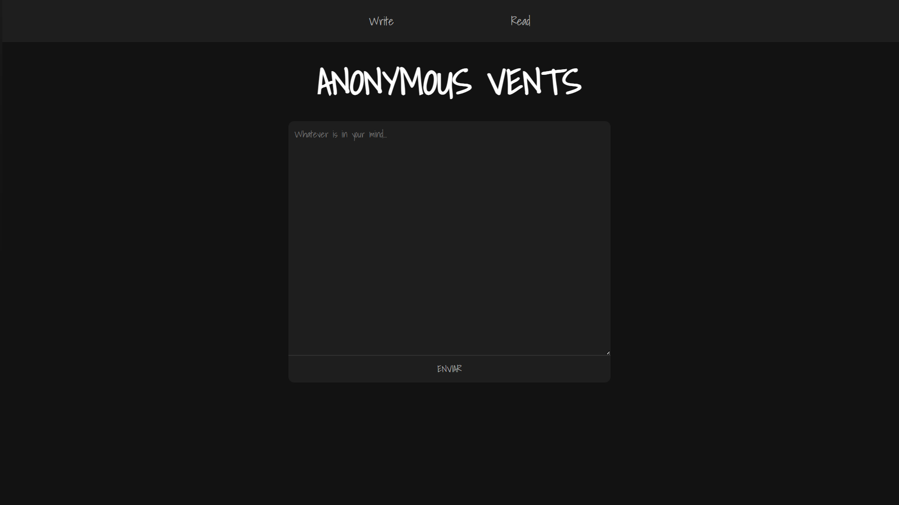

# Anonymous Vents 🌙



[🔗Experimente agora!](https://pierry-savio.github.io/anonymous-vents/) 👈

Projeto criado a fim de estudar a ferramente Firebase do Google.

Um mural de desabafos anônimos. Qualquer pessoa pode escrever o que estiver sentindo e publicar sem se identificar - e ler o que outras pessoas desabafaram.

## ✨ Funcionalidades

- 📝 Envio de desabafos anônimos, sem necessidade de login
- 📖 Listagem de todas as mensagens em tempo real (atualiza sozinha, sem precisar recarregar a página)
- 🔍 Busca por palavra-chave entre mensagens publicadas
- 🔒 Regras de segurança que impedem edição ou exclusão de posts por visitantes
- ⏱️ Proteção básica contra spam (tempo de espera entre envios)

## 🛠️ Tecnologias

- **HTML5**
- **SASS/SCSS** (compilado com [Live Sass Compiler](https://marketplace.visualstudio.com/items?itemName=ritwickdey.LiveSass))
- **JavaScript** (ES Modules)
- **Firebase Firestore** - banco de dados em tempo real

## 🗄️ Estrutura dos dados

Cada post é salvo no Firestore como um documento na coleção `desabafos`:

```js
{
  texto: "conteúdo do desabafo",
  criadoEm: Timestamp
}
```

## 🛡️ Moderação

Como o app não tem login nem painel de administração, a exclusão de posts indevidos é feita manualmente pelo dono do projeto.

## 📄 Licença

Este projeto está disponível livremente para fins de estudo e uso pessoal.
